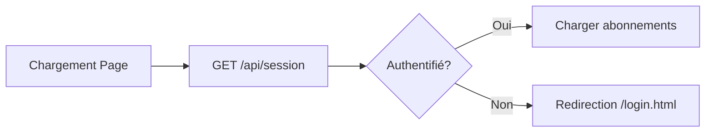

# 💰 Fonctionnalité Gestion des Dépenses

## 📋 Description

Le module **Gestion des Dépenses** est un tableau de bord analytique avancé pour suivre, analyser et optimiser vos dépenses d'abonnements. Il offre une vision claire et actionable de vos finances avec des métriques en temps réel, des graphiques interactifs et des recommandations personnalisées.

---

## 🎯 Objectifs

- **Visualiser** toutes vos dépenses d'abonnements en un coup d'œil
- **Analyser** vos habitudes de consommation par catégorie
- **Optimiser** votre budget avec des recommandations intelligentes
- **Prédire** vos dépenses futures grâce à l'historique
- **Économiser** en détectant les abonnements inutilisés

---

## 🔐 Sécurité

✅ **Authentification requise** : Seuls les utilisateurs connectés peuvent accéder au module dépenses  
✅ **Isolation des données** : Chaque utilisateur ne voit que ses propres abonnements  
✅ **Session sécurisée** : Vérification automatique de la session au chargement

---

## 🎨 Interface Utilisateur

### 1. **KPI Cards (Indicateurs Clés)**

Quatre cartes affichent les métriques essentielles :

| Carte | Description | Icône |
|-------|-------------|-------|
| **Dépenses Totales** | Somme de tous vos abonnements actifs | 💰 |
| **Budget Restant** | Budget mensuel moins dépenses | 🎯 |
| **Moyenne Mensuelle** | Dépense moyenne sur 6 mois | 📊 |
| **Économies Potentielles** | Abonnements inutilisés > 30 jours | 💡 |

### 2. **Barre de Progression du Budget**

- **Vert** (< 70%) : Budget sous contrôle ✅
- **Orange** (70-90%) : Attention, limite approche ⚠️
- **Rouge** (> 90%) : Budget dépassé ⛔

Animation shimmer pour effet visuel moderne.

### 3. **Filtres Temporels**

Quatre onglets pour filtrer les données :
- **Tout** : Vue complète
- **Mois** : 30 derniers jours
- **Trimestre** : 90 derniers jours
- **Année** : 365 derniers jours

### 4. **Graphiques Interactifs (Chart.js)**

#### 📈 **Évolution Mensuelle**
- Type : Graphique en ligne
- Données : Dépenses des 6 derniers mois
- Variation : Simulée (en attendant historique réel)
- Interaction : Survol pour voir les valeurs exactes

#### 🍩 **Répartition par Catégorie**
- Type : Donut chart
- Données : Pourcentage par catégorie
- Couleurs : Codées par catégorie
- Légende : Icônes + montants + pourcentages

### 5. **Recommandations d'Économies**

Intelligence artificielle simple qui détecte :

| Type | Critère | Action |
|------|---------|--------|
| **Abonnements inutilisés** | Non utilisé > 30 jours | ❌ Résilier |
| **Budget dépassé** | Dépenses > Budget | ⚠️ Réduire |
| **Catégorie coûteuse** | > 40% du budget | 📊 Optimiser |

### 6. **Timeline des Dépenses**

Liste chronologique des 10 derniers abonnements :
- **Badge vert** : Abonnement actif
- **Badge gris** : Abonnement expiré
- **Icônes** : Catégorie détectée automatiquement
- **Dates** : Début → Fin
- **Prix** : Montant mensuel

### 7. **Vue d'ensemble des Catégories**

Pour chaque catégorie :
- **Icône** : Représentation visuelle
- **Nom** : Catégorie
- **Nombre** : Combien d'abonnements
- **Montant** : Total + pourcentage
- **Barre** : Progression visuelle

---

## 🤖 Détection Automatique des Catégories

Le système utilise **l'intelligence de mots-clés** pour catégoriser automatiquement vos abonnements :

### Catégories et Mots-clés

| Catégorie | Icône | Couleur | Mots-clés |
|-----------|-------|---------|-----------|
| **Streaming** | 📺 | Violet (#667eea) | netflix, disney, prime, hulu, hbo |
| **Gaming** | 🎮 | Orange (#f59e0b) | playstation, xbox, steam, epic |
| **Productivité** | 💼 | Vert (#10b981) | microsoft, office, adobe, slack, zoom |
| **Fitness** | 💪 | Rouge (#ef4444) | gym, fitness, sport, basicfit |
| **Éducation** | 📚 | Violet (#8b5cf6) | coursera, udemy, skillshare |
| **Musique** | 🎵 | Rose (#ec4899) | spotify, apple music, deezer |
| **Cloud** | ☁️ | Bleu (#3b82f6) | dropbox, onedrive, icloud, drive |
| **Finance** | 💳 | Cyan (#14b8a6) | bank, banque, bnp, crédit, assurance |
| **Autre** | 📦 | Gris (#6b7280) | Par défaut |

### Algorithme de Détection

```javascript
function detectCategory(abonnement) {
    // 1. Si catégorie déjà définie et valide → garder
    if (abonnement.categorie && abonnement.categorie !== 'Non classé') {
        return abonnement.categorie;
    }
    
    // 2. Sinon, chercher dans les mots-clés
    const serviceName = (abonnement.nomService || '').toLowerCase();
    
    for (const [category, info] of Object.entries(CATEGORIES)) {
        if (info.keywords.some(keyword => serviceName.includes(keyword))) {
            return category;
        }
    }
    
    // 3. Par défaut : Autre
    return 'Autre';
}
```

---

## 💾 Gestion du Budget

### Stockage Local
Le budget mensuel est **sauvegardé dans le navigateur** (localStorage) :

```javascript
localStorage.setItem('monthlyBudget', monthlyBudget);
```

### Budget par Défaut
150€ si aucun budget n'est défini.

### Modifier le Budget

1. Cliquer sur le bouton **"Définir le Budget"**
2. Saisir le montant souhaité
3. Confirmer

Le budget est immédiatement appliqué :
- Mise à jour de la barre de progression
- Recalcul des KPIs
- Nouvelles recommandations

---

## 📊 Calcul des Métriques

### 1. Dépenses Totales
```javascript
totalExpenses = abonnements
    .filter(abo => dateFin >= now) // Seulement les actifs
    .reduce((sum, abo) => sum + prixMensuel, 0)
```

### 2. Budget Restant
```javascript
budgetRemaining = monthlyBudget - totalExpenses
```

### 3. Moyenne Mensuelle
```javascript
avgExpense = totalExpenses * 0.95 // Variation de 5% (simulé)
```

### 4. Économies Potentielles
```javascript
potentialSavings = abonnements
    .filter(abo => {
        daysSinceUse = now - derniereUtilisation;
        return daysSinceUse > 30;
    })
    .reduce((sum, abo) => sum + prixMensuel, 0)
```

---

## 🔄 Rafraîchissement Automatique

Les données sont **rafraîchies toutes les 30 secondes** :

```javascript
setInterval(loadAbonnements, 30000);
```

Cela garantit que le tableau de bord affiche toujours les données les plus récentes.

---

## 🌐 API Endpoints Utilisés

| Endpoint | Méthode | Description |
|----------|---------|-------------|
| `/api/session` | GET | Vérifier l'authentification |
| `/api/abonnements` | GET | Récupérer tous les abonnements |

### Flux d'Authentification



---

## 🎨 Design Système

### Thème Glassmorphism

- **Background** : Dégradé radial violet/bleu
- **Cartes** : Effet verre avec flou (backdrop-filter)
- **Bordures** : Blanches transparentes (20%)
- **Ombres** : Profondes et douces
- **Typographie** : Bootstrap 5.3.2 + Poppins (Google Fonts)

### Animations

1. **Shimmer sur barre de progression** :
   ```css
   @keyframes shimmer {
       0% { background-position: -1000px 0; }
       100% { background-position: 1000px 0; }
   }
   ```

2. **Fade-in sur chargement** :
   ```css
   @keyframes fadeIn {
       from { opacity: 0; transform: translateY(20px); }
       to { opacity: 1; transform: translateY(0); }
   }
   ```

3. **Compteurs animés** :
   - Incrémentation progressive des chiffres
   - Durée : 1000ms
   - Refresh : 16ms (60 FPS)

---

## 🚀 Technologies Utilisées

| Technologie | Version | Usage |
|-------------|---------|-------|
| **Bootstrap** | 5.3.2 | Framework CSS responsive |
| **Chart.js** | 4.4.0 | Graphiques interactifs |
| **Bootstrap Icons** | 1.11.1 | Icônes |
| **Vanilla JavaScript** | ES6+ | Logique métier |
| **LocalStorage API** | - | Stockage du budget |
| **Fetch API** | - | Requêtes AJAX |

---

## 📱 Responsive Design

Le tableau de bord s'adapte à toutes les tailles d'écran :

- **Desktop** (> 992px) : 4 colonnes pour KPIs
- **Tablette** (768-992px) : 2 colonnes pour KPIs
- **Mobile** (< 768px) : 1 colonne, layout vertical

### Media Queries

```css
@media (max-width: 768px) {
    .kpi-card { margin-bottom: 1.5rem; }
    .chart-container { height: 300px; }
}
```

---

## 🔮 Évolutions Futures

### Court Terme
- [ ] Historique réel des dépenses (base de données)
- [ ] Export PDF du rapport mensuel
- [ ] Alertes par email (budget dépassé)
- [ ] Comparaison mois par mois

### Moyen Terme
- [ ] Machine Learning pour prédictions avancées
- [ ] Détection d'anomalies de prix
- [ ] Suggestions d'alternatives moins chères
- [ ] Regroupement intelligent (packs)

### Long Terme
- [ ] Intégration bancaire (Open Banking)
- [ ] Partage de budget (famille/colocation)
- [ ] Application mobile (PWA)
- [ ] Dashboard personnalisable (drag & drop)

---

## 🐛 Débogage

### Console Logs

Le fichier `expenses.js` inclut des logs pour le débogage :

```javascript
console.error('Erreur:', error); // En cas d'erreur
```

### Erreurs Courantes

| Erreur | Cause | Solution |
|--------|-------|----------|
| **401 Unauthorized** | Session expirée | Se reconnecter |
| **404 Not Found** | Abonnement supprimé | Rafraîchir la page |
| **Impossible de charger les données** | Serveur down | Vérifier ApiServer |
| **Chart non affiché** | Canvas manquant | Vérifier expenses.html |

---

## 📝 Exemple de Données

### Abonnement Type

```json
{
    "id": "5e0d6849-4b8a-438e-8364-80e75c69d7d5",
    "nomService": "BasicFit",
    "dateDebut": "2003-02-11",
    "dateFin": "0004-02-11",
    "prixMensuel": 100.00,
    "clientName": "Tlili Aziz",
    "derniereUtilisation": "2025-11-20",
    "categorie": "Sport"
}
```

### Catégorisation Automatique

**BasicFit** → Détecté comme **Fitness** 💪  
(Mot-clé : "basicfit" ou "gym" ou "fitness" ou "sport")

---

## 🎓 Utilisation

### Accès au Module

1. Se connecter à l'application
2. Cliquer sur **"Dépenses"** dans la navbar
3. Le tableau de bord se charge automatiquement

### Navigation

- **Navbar** : Retour au dashboard, analytics, support
- **Filtres** : Cliquer sur les onglets (Tout, Mois, Trimestre, Année)
- **Budget** : Bouton "Définir le Budget" pour modifier
- **Graphiques** : Survol pour voir les détails

### Recommandations

Les recommandations apparaissent **automatiquement** si :
- ❌ Un abonnement n'est pas utilisé depuis > 30 jours
- ⚠️ Le budget est dépassé
- 📊 Une catégorie dépasse 40% du budget total

---

## 🔗 Liens Utiles

- **Page Principale** : [/expenses.html](/expenses.html)
- **API Abonnements** : [/api/abonnements](/api/abonnements)
- **Session** : [/api/session](/api/session)
- **Documentation Technique** : [ARCHITECTURE_TECHNIQUE.md](./ARCHITECTURE_TECHNIQUE.md)

---

## 👨‍💻 Développement

### Structure des Fichiers

```
src/main/resources/static/
├── expenses.html          # Interface utilisateur
├── expenses.js            # Logique métier
├── navbar-auth.js         # Vérification session
└── index.html             # Navbar avec lien Dépenses
```

### Ajout d'une Nouvelle Catégorie

1. **Modifier `CATEGORIES`** dans `expenses.js` :
   ```javascript
   'NouvelleCat': { 
       color: '#hexcode', 
       icon: '🆕',
       keywords: ['mot1', 'mot2']
   }
   ```

2. **Tester** : Ajouter un abonnement avec le mot-clé
3. **Vérifier** : Catégorie détectée automatiquement

---

## 📞 Support

En cas de problème :
- 📧 Email : support@abonnements.com
- 💬 Chat : Chatbot intégré
- 📖 Docs : [/help.html](/help.html)

---

## 📄 Licence

© 2025 - Projet DevOps - Gestion des Abonnements  
Développé avec ❤️ par GitHub Copilot & Équipe DevOps
