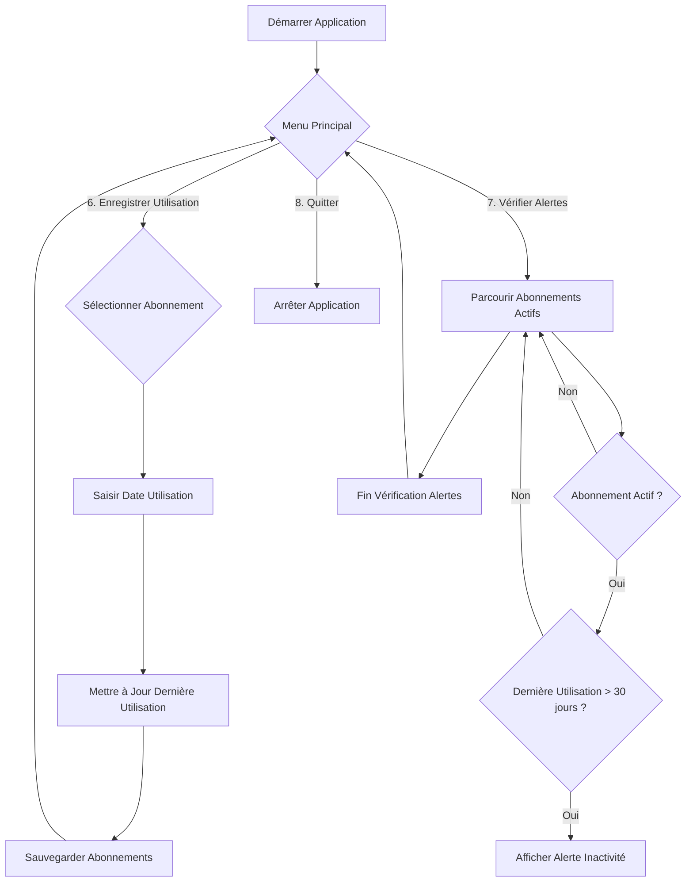

## Fiche de Fonctionnalité 2 : Alerte d'Inactivité Intelligente

### Titre de la Fonctionnalité
**Alerte d'Inactivité Intelligente : Ne payez plus pour rien !**

### Persona Utilisateur

**Nom :** Marc, le Consommateur Averti
**Âge :** 28 ans
**Occupation :** Jeune professionnel, soucieux de ses dépenses
**Objectifs :** Optimiser son budget, s'assurer qu'il tire le meilleur parti de chaque abonnement, éviter les dépenses inutiles pour des services qu'il n'utilise pas.
**Frustrations :** Payer des abonnements oubliés, la difficulté de suivre son utilisation réelle de certains services, le sentiment de gaspiller de l'argent.

Marc utilise cette fonctionnalité pour être proactif dans la gestion de ses abonnements et pour s'assurer qu'il ne paie que pour ce qu'il utilise réellement.

### Ce que fait la fonctionnalité
Cette fonctionnalité, c'est ma petite touche personnelle et un peu la "killer feature" de mon application ! L'idée m'est venue en pensant à mon abonnement à la salle de sport (comme Basic-Fit). On paie tous les mois, mais parfois, on n'y va pas pendant longtemps. Avec cette fonctionnalité, l'application aide Marc à ne plus gaspiller son argent.

Concrètement, ça marche comme ça :

*   **Suivi de la dernière utilisation** : Pour chaque abonnement, je peux enregistrer la date de la dernière fois que j'ai utilisé le service. Pour une salle de sport, ça pourrait être la date où j'ai scanné mon QR code. Pour un service de streaming, ça pourrait être la dernière fois que j'ai regardé un film.
*   **Détection d'inactivité** : L'application vérifie régulièrement (quand on lance l'option) si un abonnement actif n'a pas été utilisé depuis un certain temps. J'ai mis un seuil de 30 jours, mais ça pourrait être configurable.
*   **Génération d'alerte** : Si un abonnement est actif mais n'a pas été utilisé depuis plus de 30 jours, l'application affiche une alerte claire. Elle rappelle à Marc quel abonnement est concerné, depuis combien de temps il est inactif, et combien ça lui coûte par mois. Le but est de lui faire prendre conscience qu'il paie peut-être pour un service qu'il n'utilise pas.
*   **Incitation à l'action** : L'alerte suggère à Marc de soit utiliser son abonnement, soit de le résilier pour éviter des frais inutiles. C'est un petit coup de pouce pour l'aider à mieux gérer son budget.

J'ai ajouté un champ `derniereUtilisation` à ma classe `Abonnement` et j'ai modifié les méthodes de sauvegarde/chargement pour que cette information soit persistante. C'est un bon exemple de comment on peut ajouter de l'intelligence à une application simple.

### Diagramme de Flux (Smart Inactivity Alert Flow)

### Axes d'amélioration (pour un futur projet ou une V2)

*   **Seuil d'alerte configurable** : Actuellement, le seuil est fixé à 30 jours. Il serait intéressant de permettre à l'utilisateur de configurer ce seuil (par exemple, 15 jours pour un abonnement de sport, 60 jours pour un abonnement annuel).
*   **Types d'abonnements spécifiques** : Certains abonnements n'ont pas de notion d'utilisation (ex: assurance). On pourrait ajouter un type d'abonnement pour désactiver l'alerte d'inactivité pour ces cas-là.
*   **Historique d'utilisation** : Au lieu d'une simple date de dernière utilisation, on pourrait stocker un historique des utilisations (par exemple, les 5 dernières dates) pour avoir une vue plus fine de l'activité.
*   **Notifications** : Dans une application graphique, on pourrait imaginer des notifications push ou des e-mails pour alerter l'utilisateur, au lieu d'une simple alerte console.
*   **Analyse des coûts d'inactivité** : Calculer le coût total des abonnements inactifs sur une période donnée pour montrer à l'utilisateur combien il "perd" potentiellement.
*   **Intégration API (plus complexe)** : Pour aller plus loin, on pourrait essayer d'intégrer des APIs de services réels (si disponibles et avec autorisation) pour récupérer automatiquement les données d'utilisation, sans saisie manuelle. C'est un gros morceau, mais ça rendrait la fonctionnalité super puissante !
