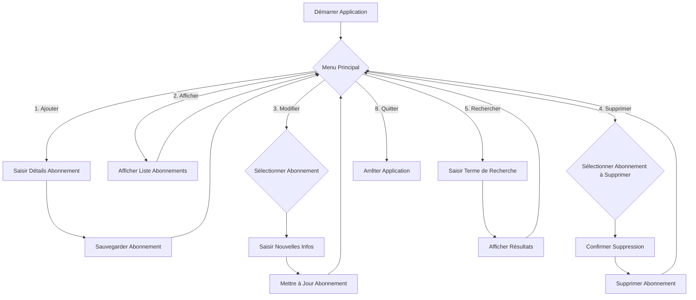

## Fiche de Fonctionnalité 1 : Gestion Complète des Abonnements (CRUD)

### Titre de la Fonctionnalité
**Gestion Complète des Abonnements (CRUD : Création, Lecture, Mise à jour, Suppression)**

### Persona Utilisateur

**Nom :** Léa, l'Étudiante Organisée
**Âge :** 21 ans
**Occupation :** Étudiante en Master, travaille à temps partiel
**Objectifs :** Gérer son budget serré, ne pas oublier les dates de renouvellement de ses abonnements (streaming, logiciels, salle de sport), et savoir exactement ce qu'elle paie chaque mois.
**Frustrations :** Oublier un abonnement qu'elle n'utilise plus, ne pas savoir combien elle dépense réellement, la complexité de suivre plusieurs abonnements sur différentes plateformes.

Léa utilise cette application pour avoir une vue d'ensemble claire de ses engagements financiers et pour pouvoir agir rapidement si elle doit modifier ou annuler un abonnement.

### Ce que fait la fonctionnalité
Cette fonctionnalité est vraiment le cœur de mon application ! Elle permet à Léa de gérer de A à Z tous ses abonnements. En gros, c'est un système **CRUD** (pour *Create, Read, Update, Delete*), ce qui veut dire qu'elle peut :

*   **Ajouter un nouvel abonnement** : Quand Léa prend un nouvel abonnement (Netflix, Spotify, salle de sport, etc.), elle peut entrer toutes les infos importantes : le nom du service, le nom du client (pour qui est l'abonnement, si c'est pour elle ou un membre de sa famille), la date de début, la date de fin et le prix mensuel. C'est super pratique pour tout centraliser.
*   **Afficher tous les abonnements** : D'un coup d'œil, elle peut voir la liste complète de tous ses abonnements. L'application lui dit si l'abonnement est encore actif ou s'il est expiré, et même combien de jours il lui reste avant la fin. Ça l'aide à ne pas oublier ce qu'elle paie.
*   **Modifier un abonnement** : Si les infos d'un abonnement changent (par exemple, si le prix augmente, ou si elle change de formule), elle peut facilement mettre à jour les détails. Elle peut même corriger une faute de frappe ou changer le nom du client si besoin.
*   **Supprimer un abonnement** : Quand elle résilie un abonnement, elle peut le retirer de sa liste. Ça permet de garder sa liste propre et à jour.

J'ai utilisé des `ArrayList` pour stocker les abonnements en mémoire et j'ai mis en place un système de sauvegarde/chargement dans un fichier texte (`abonnements.txt`) pour que les données ne soient pas perdues quand elle ferme l'application. C'est une première étape vers la persistance des données, un concept super important en développement !

### Diagramme de Flux (Simplified CRUD Flow)

### Axes d'amélioration (pour un futur projet ou une V2)

*   **Validation des entrées plus robuste** : Actuellement, j'ai fait une validation basique pour les dates et les nombres. Pour un projet plus pro, il faudrait des validations plus poussées, par exemple s'assurer que le nom du service n'est pas vide, ou que le prix est toujours positif. Utiliser des expressions régulières pour certains formats pourrait être une bonne idée.
*   **Gestion des doublons** : Pour l'instant, je peux ajouter plusieurs fois le même abonnement. Il serait intéressant de vérifier si un abonnement avec les mêmes caractéristiques (client, service) existe déjà avant d'en ajouter un nouveau, ou de demander confirmation à l'utilisateur.
*   **Tri et filtrage avancés** : On pourrait ajouter des options pour trier les abonnements par date de fin, par prix, ou par nom de service. Des filtres plus complexes (par exemple, afficher seulement les abonnements actifs qui coûtent plus de X euros) seraient aussi un plus, peut-être avec une interface de recherche plus intuitive.
*   **Interface utilisateur graphique (GUI)** : Pour l'instant, c'est une application console. L'étape suivante serait de créer une interface graphique (avec Swing, JavaFX ou même une application web) pour la rendre plus agréable et facile à utiliser, ce qui améliorerait grandement l'expérience utilisateur.
*   **Base de données relationnelle** : Au lieu d'un simple fichier texte, utiliser une vraie base de données (comme MySQL, PostgreSQL ou H2 pour une base embarquée) serait beaucoup plus performant et sécurisé pour stocker les abonnements, surtout si on en a beaucoup. Cela permettrait aussi des requêtes plus complexes et une meilleure intégrité des données.
