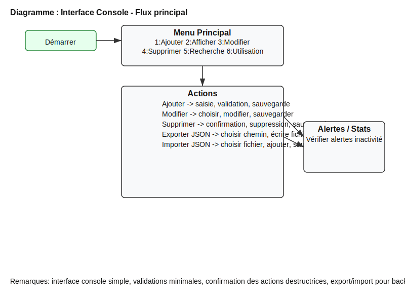

# Fiche de fonctionnalité — Interface Console Améliorée

Résumé
-------
Cette fiche décrit l'amélioration de l'interface console de l'application de gestion des abonnements.

But
---
Rendre l'application plus agréable à utiliser en console, avec des actions supplémentaires et des protections contre les erreurs (confirmation avant suppression, options d'export/import JSON).

Utilisateurs cibles
------------------
- Utilisateur individuel qui gère ses abonnements depuis une machine locale.

Détails fonctionnels
--------------------
- Menu enrichi : ajout des options Exporter en JSON et Importer depuis JSON.
- Confirmation avant suppression d'un abonnement.
- Messages plus clairs pour les erreurs et succès.

Cas d'utilisation
------------------
1. L'utilisateur lance le programme. Il voit un menu clair.
2. Il choisit d'exporter ses abonnements : il saisit un chemin (ou laisse par défaut) ; un fichier JSON est créé.
3. Il choisit d'importer : il donne le chemin d'un JSON ; les abonnements sont ajoutés et sauvegardés.
4. Il supprime un abonnement : l'application demande une confirmation explicite.

Contraintes et validation
------------------------
- Le format JSON suit la structure des champs de la classe `Abonnement`.
- L'import accepte les fichiers JSON produits par l'application.

Mesures de succès
-----------------
- L'utilisateur peut exporter et importer sans erreur.
- Les suppressions accidentelles sont réduites grâce à la confirmation.

Fichiers impactés
-----------------
- `src/main/java/com/example/abonnement/GestionAbonnements.java` (modification du menu, nouvelles méthodes).

Notes de conception
-------------------
- Implementation simple avec Jackson pour la sérialisation JSON.
- L'approche favorise la simplicité et la compatibilité.

Diagramme
---------

