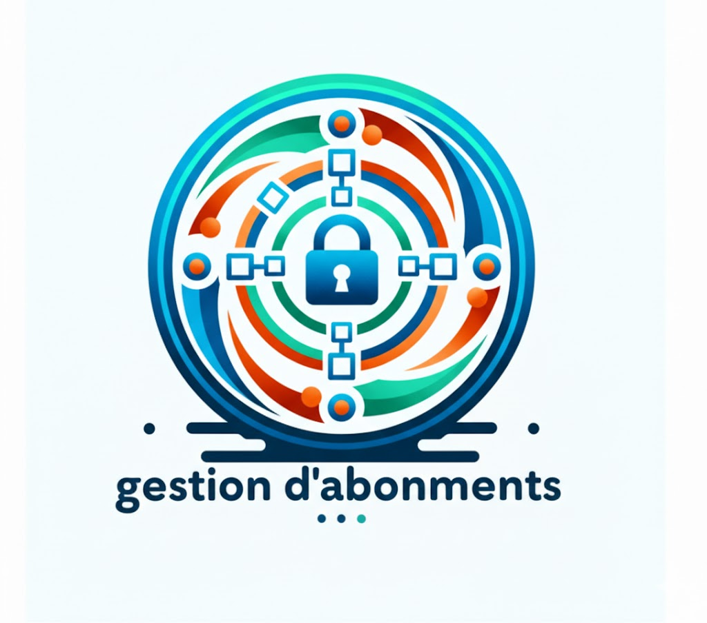
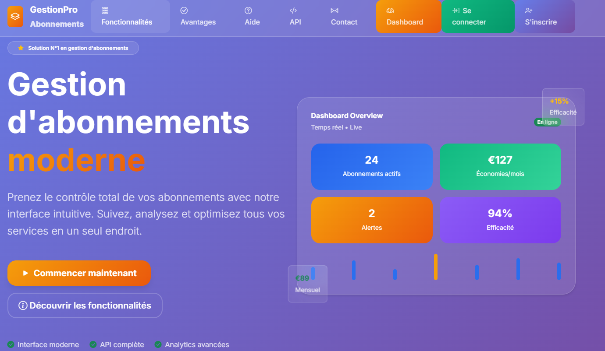
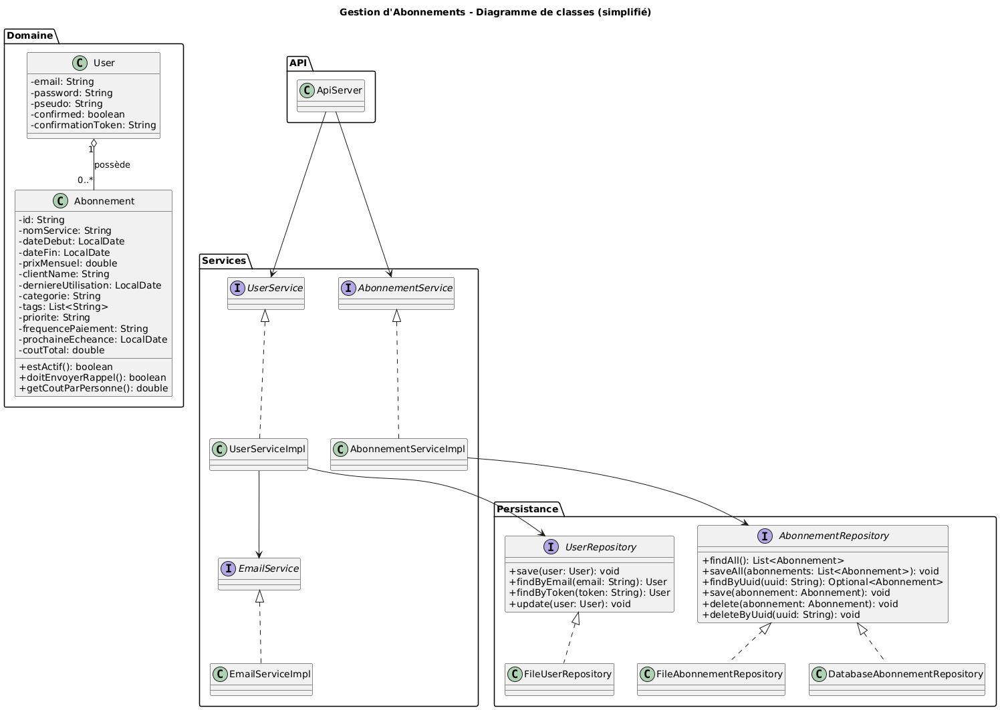
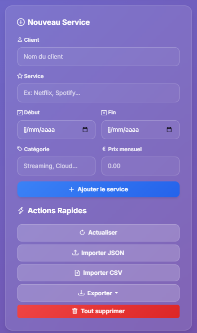
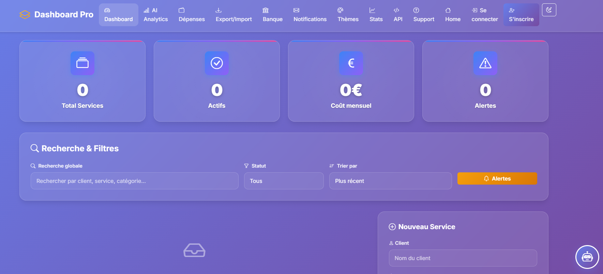
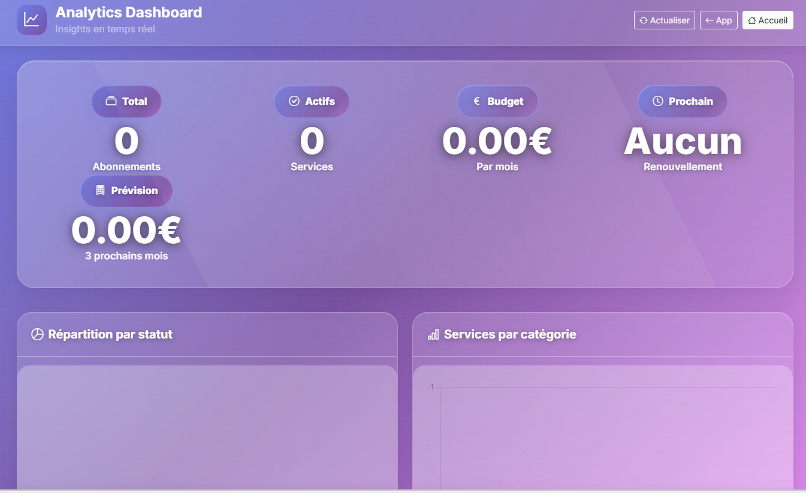
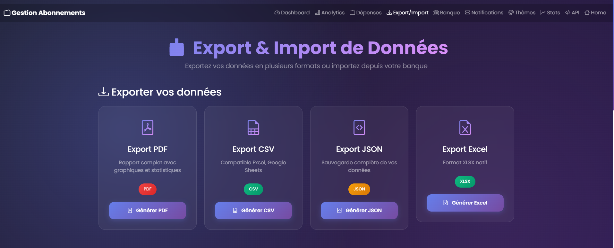
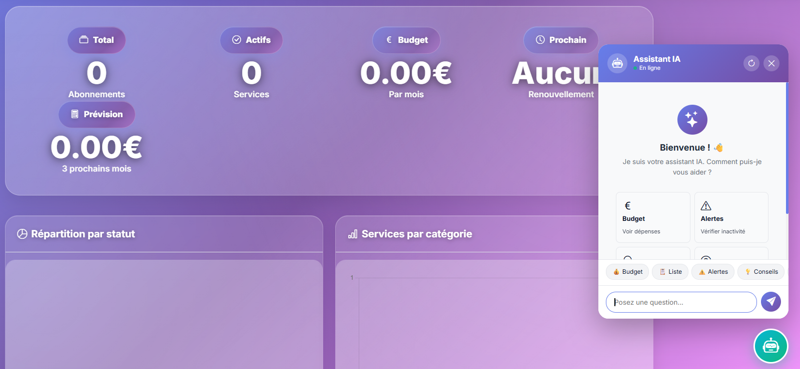
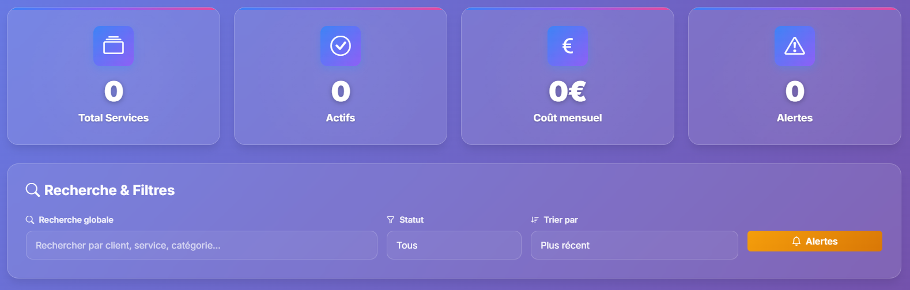

= Projet DevOps - Gestion d’Abonnements

[.text-center]
Aziz TLILI
[.text-center]
Mayssara FERKOUS
[.text-center]
Thi Mai Chi DOAN

[]

[.text-center]
[.version.bottom-version]
*Version 1.0 du 18 janvier 2026*

<<<

== Introduction

Bienvenue dans l’univers de Gestion d’Abonnements, une application conçue pour répondre à une problématique devenue centrale dans la vie numérique actuelle : la multiplication des services par abonnement et la difficulté pour les utilisateurs de suivre, comprendre et maîtriser leurs dépenses.

Entre les plateformes de streaming, les services numériques, les abonnements téléphoniques ou encore les offres logicielles, il est aujourd’hui courant de cumuler de nombreux abonnements, parfois oubliés ou très peu utilisés. Cette situation entraîne souvent une perte de visibilité sur le budget réel engagé chaque mois.

L’objectif de ce projet DevOps est de proposer une application simple, moderne et efficace permettant aux utilisateurs de centraliser l’ensemble de leurs abonnements au sein d’un même outil. L’application offre une vision claire des coûts, met en évidence les abonnements actifs ou inactifs et fournit des statistiques visuelles afin d’aider à la prise de décision.

Au-delà de l’aspect fonctionnel, ce projet s’inscrit également dans une démarche pédagogique. Il vise à mettre en pratique les concepts fondamentaux du développement logiciel et du DevOps : architecture applicative, séparation des responsabilités, mise en place d’une API REST, persistance des données, interface utilisateur et documentation complète.

Grâce à une architecture full-stack reposant sur des technologies modernes, Gestion d’Abonnements se positionne comme un assistant numérique permettant aux utilisateurs de mieux comprendre leurs habitudes de consommation et d’optimiser leur budget au quotidien.

== Interconnexions

L’application Gestion d’Abonnements repose sur une architecture moderne et structurée, pensée pour garantir une bonne séparation des responsabilités et une évolution facilitée du projet. Chaque composant joue un rôle précis dans le fonctionnement global de l’application.

L’architecture adoptée est de type full-stack, combinant une interface utilisateur accessible via un navigateur web et un backend Java chargé du traitement des données et de la logique métier.

=== Architecture générale

Le système est organisé autour de trois grands blocs :

* *Le Frontend* : interface utilisateur
* *Le Backend* : logique applicative et API
* *La persistance des données* : stockage des informations

Ces éléments communiquent entre eux via des échanges HTTP, principalement au format JSON.

=== Frontend

La partie frontend correspond à la couche visible par l’utilisateur. Elle est développée en *HTML, CSS et JavaScript*, avec une attention particulière portée à l’ergonomie et à la lisibilité. L’interface propose un tableau de bord clair, des cartes d’abonnements, des indicateurs visuels (KPI) ainsi que des graphiques facilitant la compréhension des données.

Le frontend interagit directement avec l’API REST afin de récupérer, afficher et mettre à jour les abonnements. Cette séparation permet de modifier l’interface sans impacter la logique métier.

=== Backend

Le backend constitue le cœur de l’application. Il est développé en Java 17 et repose sur le framework Spark, un micro-framework léger permettant de créer rapidement une API REST.

Cette couche est responsable de :

* la gestion des abonnements
* la validation des données
* le calcul des statistiques
* la détection des abonnements inactifs
* l’exposition des routes API

La logique métier est volontairement isolée afin de garantir un code clair, maintenable et évolutif.

=== API REST

L’API REST assure la communication entre le frontend et le backend. Elle expose différentes routes permettant d’effectuer des opérations CRUD (Create, Read, Update, Delete) sur les abonnements.

Les échanges se font au format JSON, ce qui rend l’application facilement extensible vers d’autres clients (application mobile, scripts externes, etc.).

=== Persistance des données

Deux modes de persistance sont disponibles :

* *Mode fichier* : stockage des abonnements dans des fichiers texte (CSV)
* *Mode base de données* : utilisation d’une base H2 embarquée

Ce choix offre une grande flexibilité et permet de comparer différentes stratégies de stockage dans un cadre pédagogique.

== Données acquises et manipulées

Afin de fournir une expérience complète et personnalisée, l’application manipule plusieurs types de données essentielles à son fonctionnement.

=== Abonnements

L’entité principale de l’application est l’abonnement. Chaque abonnement contient notamment :

* le nom du service
* la date de début
* la date de fin
* le prix mensuel
* la catégorie
* la date de dernière utilisation

Ces informations permettent de calculer automatiquement les coûts, de déterminer si un abonnement est actif et de détecter les périodes d’inactivité.

=== Utilisateurs

L’application gère également des utilisateurs, chacun disposant de son propre espace de données. Cette séparation garantit que les abonnements d’un utilisateur ne sont pas visibles par les autres.

Chaque utilisateur est identifié par des informations simples telles que :

* un email
* un mot de passe
* un identifiant interne

=== Relations entre les données

Un utilisateur peut posséder plusieurs abonnements, mais un abonnement appartient à un seul utilisateur. Cette relation permet d’organiser les données de manière cohérente et de proposer des statistiques personnalisées.

Un diagramme de classes illustre les relations entre les différentes entités du système et met en évidence la structure orientée objet adoptée dans le projet.

== Comment lancer le projet

Cette section décrit les étapes nécessaires pour installer et exécuter l’application en local.

=== Prérequis

Pour lancer le projet, il est nécessaire de disposer de :

* Java 17 ou version supérieure
* Apache Maven
* Un navigateur web récent (Chrome, Firefox, Edge)

=== Récupération du projet

Le code source est hébergé sur un dépôt Git. Après clonage du projet, il suffit de se placer à la racine du répertoire.

=== Compilation

La compilation du projet se fait à l’aide de Maven :

[source,bash]
----
mvn clean package
----

Cette commande permet de vérifier le bon fonctionnement du projet et de générer les artefacts nécessaires.

=== Lancement du serveur

Le serveur backend peut être lancé avec la commande suivante :

[source,bash]
----
mvn exec:java -Dexec.mainClass=com.projet.api.ApiServer
----

Exécution option A :

[source,bash]
----
mvn exec:java -Dexec.mainClass=com.example.abonnement.GestionAbonnements
----

Exécution option B :
Par défaut, mvn package ne produit pas d'uber-jar (les dépendances ne sont pas incluses). Si vous voulez un seul fichier exécutable, il faut ajouter le plugin maven-shade-plugin au pom.xml . Sinon, lance le JAR produit en t'assurant que le classpath contient les dépendances. 

[source,bash]
----
java -jar target/gestion-abonnements-1.0-SNAPSHOT.jar
----

Par défaut, l’application est accessible à l’adresse :

[source]
----
http://localhost:4567
----

=== Accès à l’interface utilisateur

Une fois le serveur démarré, l’interface web est automatiquement servie par le backend. L’utilisateur peut alors accéder au tableau de bord, gérer ses abonnements et consulter les statistiques.

== Fonctionnalités

Cette section présente les principales fonctionnalités de l’application Gestion d’Abonnements. Chaque fonctionnalité répond à un besoin précis de l’utilisateur et s’intègre de manière cohérente dans l’architecture globale du système.

=== F1 – Gestion des abonnements (CRUD)

La fonctionnalité centrale de l’application est la gestion complète des abonnements. Elle permet à l’utilisateur de créer, consulter, modifier et supprimer ses abonnements de manière simple et intuitive.

Lors de l’ajout d’un abonnement, l’utilisateur renseigne les informations essentielles telles que le nom du service, la date de début, la date de fin, le prix mensuel et la catégorie. Une fois validé, l’abonnement apparaît immédiatement dans la liste et les indicateurs du tableau de bord sont mis à jour automatiquement.

La modification d’un abonnement permet d’ajuster les informations à tout moment, par exemple en cas de changement de tarif ou de prolongation de la durée. La suppression est protégée par une confirmation afin d’éviter toute suppression accidentelle.

Cette fonctionnalité constitue la base de l’application et garantit une gestion fiable et structurée des données.

=== F2 – Alertes d’inactivité

L’application intègre un système d’alertes permettant de détecter les abonnements peu ou pas utilisés. Lorsqu’un abonnement n’a pas été utilisé depuis plus de 30 jours, une alerte visuelle apparaît.

Ce mécanisme aide l’utilisateur à identifier rapidement les services inutiles ou oubliés. Les alertes sont visibles directement sur le tableau de bord et contribuent à une meilleure maîtrise du budget.

Grâce à cette fonctionnalité, l’utilisateur est encouragé à analyser ses habitudes de consommation et à prendre des décisions éclairées, comme la résiliation d’un abonnement non rentable.

=== F3 – Statistiques et indicateurs clés (KPI)

Afin de fournir une vision globale et synthétique, l’application propose plusieurs indicateurs clés de performance.

Parmi les KPI affichés figurent :

* le nombre total d’abonnements
* le nombre d’abonnements actifs
* le coût mensuel total
* le nombre d’alertes d’inactivité

Ces indicateurs sont complétés par des graphiques interactifs permettant de visualiser la répartition des dépenses par catégorie ainsi que l’évolution des coûts dans le temps.

Cette fonctionnalité facilite la compréhension des données financières et transforme des informations brutes en éléments visuels exploitables.

=== F4 – Import et export des données

L’application permet à l’utilisateur d’exporter ses abonnements sous différents formats, notamment en JSON. Cette fonctionnalité est utile pour effectuer des sauvegardes ou transférer les données vers un autre environnement.

L’import de données permet quant à lui de restaurer une sauvegarde ou d’ajouter plusieurs abonnements en une seule opération. Un contrôle de validité est effectué afin d’éviter les erreurs de format.

Cette fonctionnalité renforce la fiabilité du système et garantit la portabilité des données.

=== F5 – Chatbot intelligent

Un chatbot intelligent est intégré à l’application afin d’améliorer l’expérience utilisateur. Il permet d’interagir avec le système en langage naturel.

L’utilisateur peut, par exemple, demander :

* le montant de son budget mensuel
* la liste de ses abonnements actifs
* les alertes d’inactivité en cours

Le chatbot analyse les requêtes, identifie les intentions et fournit des réponses contextualisées basées sur les données réelles de l’utilisateur.

Cette fonctionnalité apporte une dimension interactive et innovante à l’application.

=== F6 – Tableau de bord et filtres

Le tableau de bord constitue le point d’entrée principal de l’application. Il regroupe les abonnements sous forme de cartes claires et lisibles.

Des filtres permettent de trier les abonnements par catégorie, par statut ou par recherche textuelle. Ces outils facilitent la navigation et améliorent la lisibilité lorsque le nombre d’abonnements devient important.

L’ensemble du tableau de bord est conçu pour offrir une expérience utilisateur fluide, moderne et accessible.

== Conclusion

Le projet Gestion d’Abonnements s’inscrit pleinement dans une démarche pédagogique visant à mettre en pratique les notions fondamentales du développement logiciel et du DevOps. Tout au long de sa conception et de sa réalisation, ce projet a permis d’aborder de manière concrète des concepts essentiels tels que l’architecture applicative, la séparation des responsabilités, la gestion des données, la mise en place d’une API REST et la création d’une interface utilisateur moderne.

L’application développée répond à une problématique réelle et actuelle : la difficulté pour les utilisateurs de suivre et maîtriser leurs abonnements numériques. Grâce à une interface claire, des indicateurs visuels pertinents et des fonctionnalités telles que les alertes d’inactivité ou le chatbot intelligent, l’utilisateur dispose d’un outil lui permettant de mieux comprendre ses habitudes de consommation et d’optimiser son budget.

Sur le plan technique, le choix d’une architecture full-stack basée sur Java, Spark et des technologies web standards a permis de concevoir une application modulaire, évolutive et maintenable. La mise en place de différents modes de persistance des données offre également une vision comparative intéressante dans un cadre d’apprentissage.

Malgré ces points positifs, certaines limites subsistent. La sécurité pourrait être renforcée, notamment par l’utilisation de mécanismes d’authentification plus avancés et par le chiffrement systématique des données sensibles. De même, l’identification des abonnements repose actuellement sur des mécanismes simples qui pourraient être améliorés pour un usage en production.

Enfin, ce projet ouvre de nombreuses perspectives d’évolution. Parmi celles-ci figurent l’intégration de notifications automatiques, le développement d’une application mobile, l’ajout de fonctionnalités d’intelligence artificielle pour recommander des économies personnalisées, ainsi que le déploiement de l’application sur une infrastructure cloud.

En conclusion, Gestion d’Abonnements constitue une base solide et cohérente, à la fois sur le plan fonctionnel et technique. Il illustre de manière concrète les compétences acquises au cours du module DevOps et représente une application réaliste, extensible et adaptée aux usages numériques actuels.

